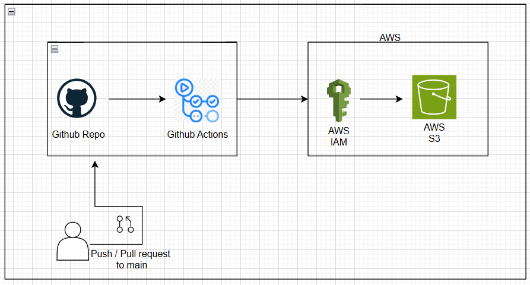

# Github-Actions-1

Deploying a Static Website on AWS using Github Actions.

## Overview

1. Github Repo holds the code which is to be deployed.

2. Github actions are triggered on following events:
    a. Push to the Main branch.
    b. Pull Request to the Main breanch.

3. Github Actions perform the following job: 
    a. Access the AWS via AWS IAM access keys
    b. Put the code into AWS S3.

